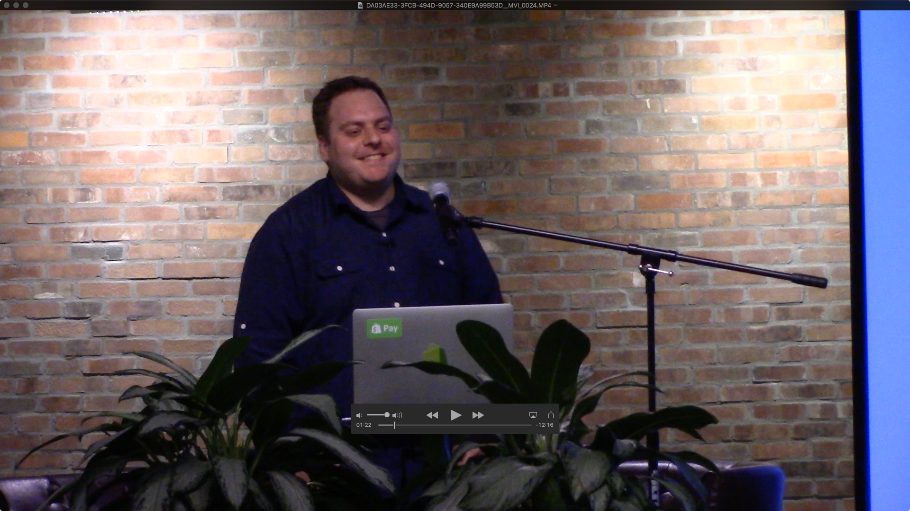

# Videographer Guide

This guide documents the recording of the Montreal Elixir meetups.

## Equipment

- Video camera
- Tripod
- Wireless microphone (lavalier mic, transmitter & receiver units)
- HDMI splitter
- HDMI capturing device
- HDMI adapters for computers
- AA batteries for the wireless units
- Batteries for the video camera (and charger)
- HDMI cables
- USB splitter and AC block to provide power to HDMI splitter and HDMI capturing device
- SD card for video camera
- SD card for HDMI capturing device
- Presentation remote
- Headphones
- MP3 Audio recorder (wireless backup)

## Overall process

1. Pre-meetup checks
2. Set-up and audio/video checks
3. Record each presentation
4. Pack equipment
5. Video editing
6. Upload to YouTube
7. Make public each recording

## Pre-meetup checks

The day before:

- make sure all the batteries are fully charged
- check the battery level on the wireless mic units (turn them on and look at the level on the screen)
- erase old files on the SD cards.

With each presenter, make sure her/his computer has notifications disabled and nightshift off. See playbook for instructions. Then do a quick HDMI capturing test, to make sure it works with her/his computer.

## At the meetup venue

### Set-up and audio/video checks

On location, you should plan about 30 minutes to set-up the equipment and check the video and audio.

Refer to this diagram for connections.

For the video camera, you want a little portion of the screen to be in the frame. This will help syncing the video with the HDMI capture during the video editing process. Here's an example of a good framing:

To the right, we see a small portion of the projection screen.  This portion will be edited out later.

### Just before the first presentation

Start the audio recording on the Tascam recorder.

### Record each presentation

- Help presenter set-up
- Install mic on presenter
- Tell presenter to wait for the OK before starting his presentation (thumbs up by the cameraman)
- Turn on HDMI capturing
- Go to the camera and check the audio using the headphones
- Wait for the presenter to be introduced by the MC
- Start video recording
- Give "thumps up" to presenter
- Stop video recording when no more questions
- Turn off HDMI capturing

Repeat for each presentation so each presentation has its own audio/video files.

Note: we do record the questions, but currently, we are not including them in the final video edit.

### Pack equipment

Do not forget any cables on location.
